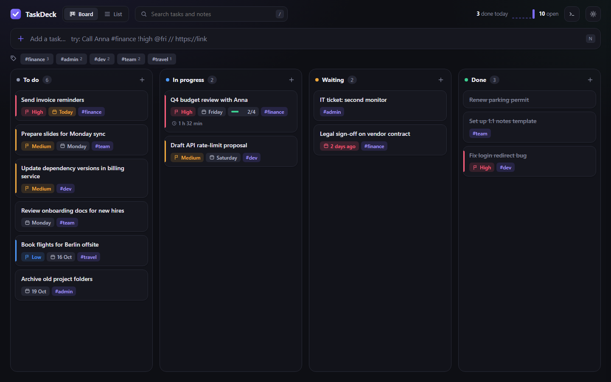
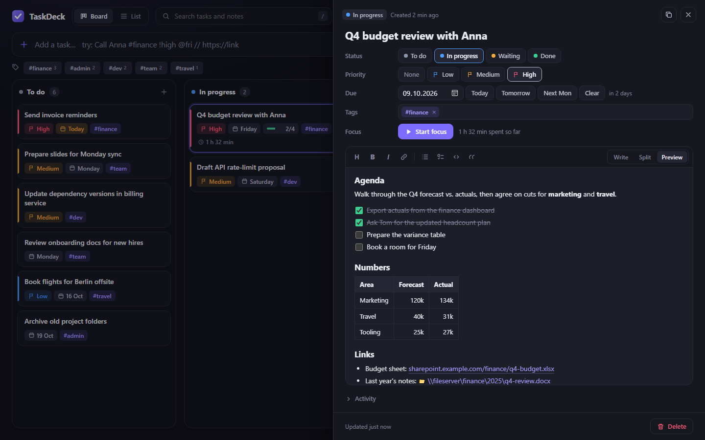

# TaskDeck

A small personal task tracker for Windows. It's one ~150 KB exe that sits in the tray. The main window is a Kanban board / list (Edge in app mode, so it looks like a normal desktop window), and you can add a task from anywhere in Windows with a hotkey.



Each task opens a panel with its status, priority, due date, tags, focus timer and its own Markdown notes:



## Build

```
powershell -ExecutionPolicy Bypass -File build.ps1
```

This uses the C# compiler that ships with every Windows 10/11 (.NET Framework 4.x), so you don't need Visual Studio, an SDK or admin rights. The pages in `web\` are embedded in the exe. Exit TaskDeck from the tray before you rebuild.

## Use

Run `TaskDeck.exe`. A violet check icon appears in the tray and the window opens.

- **Quick add from anywhere:** press **Win+Alt+N**, type, and press Enter. **Shift+Enter** adds the task and opens it.
- **Open the window:** press **Ctrl+Alt+D**, or click the tray icon.
- If a hotkey is already taken by another app, TaskDeck switches to a free one and tells you in a tray notification. The tray menu always shows the hotkeys in use.
- **Quick-add syntax** (works in the top bar, the popup and the **+** on each column):

  | Type | Meaning |
  |---|---|
  | `#work` | tag |
  | `!` `!!` `!!!` or `!low` `!med` `!high` | priority |
  | `@today` `@tomorrow` `@fri` `@12.10` `@+3d` `@2w` `@2026-12-01` (also `@jutro`, `@pt`) | due date |
  | `~doing` `~waiting` `~done` | start in another column |
  | `// anything` | everything after it becomes the note |

  Example: `Send Q4 numbers to Anna #finance !high @fri // https://sharepoint/...`

- **Statuses:** To do, In progress, Waiting, Done. You can drag cards between columns, use the arrow or check button on a card, or press `1` to `4` while a task is open.
- **Notes:** every task has its own Markdown notes, with headings, links, checklists, code blocks and tables. Use **Write / Split / Preview** to switch views.
  - Paste a screenshot (Ctrl+V) or drop a file on the editor to attach it. Files are stored in `attachments\`.
  - Links open in your normal browser. Windows paths such as `C:\Reports` or `\\server\share\doc.xlsx` open in Explorer or in their own app. Programs and scripts are only shown in Explorer, never run.
  - Click a checkbox in the preview to tick it. The card then shows checklist progress.
  - Editor keys: Ctrl+B / I / K (link) / L (checklist). Enter continues a list, and Tab indents.
- **Focus timer:** press **Start focus** on a task. Time is added to that task, a pill in the header shows the running timer, and you get a reminder after 25 minutes.
- **Extras:** a command palette (Ctrl+K) to jump to any task, a completions sparkline and a 🔥 streak, Undo after delete, "Copy as Markdown" for pasting a task into Teams or Jira, JSON export, light and dark themes, and a tray balloon at startup when tasks are due or overdue.
- **Keys:** `N` new task · `/` search · `B` / `L` board or list · `E` edit notes · `F` start or stop focus · `Esc` close

Tray menu → **Start with Windows** starts TaskDeck quietly in the tray when you log in.

## Files (next to the exe)

- `tasks.json`: all your tasks. It's written atomically on every change, and `backups\` keeps one copy per day for 14 days.
- `attachments\`: pasted screenshots and dropped files.
- `TaskDeck.ini`: port (8780), hotkeys, focus length, browser. Restart TaskDeck after you edit it.
- `web\`: the UI source. Files here override the embedded copies, so you can tweak the look without rebuilding. To always use the embedded UI, run the exe from a folder without `web\`.

To move to another PC, copy the exe together with `tasks.json` and `attachments\`.
